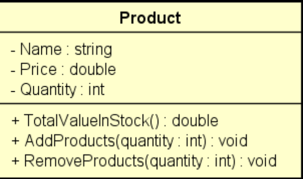

## Exercicio 01

### Fazer um programa para ler os dados de um produto em estoque (nome, preço equantidade no estoque).

*  Mostrar os **dados** do produto (nome, preço, quantidade no estoque, valor total no
estoque)

*  Realizar uma **entrada** no estoque e mostrar novamente os dados do produto

*  Realizar uma **saída** no estoque e mostrar novamente os dados do produto

Para resolver este problema, você deve criar
uma **CLASSE** conforme projeto abaixo:

